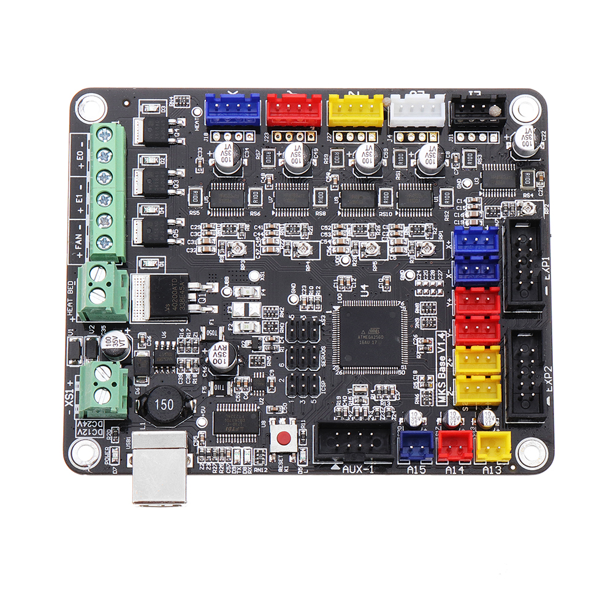

# Configuration Marlin Firmware 2.0.6 (bugfix)
Cofiguration files of Marlin Firmware to Tevo Tarantula (MKS Base 1.4)

*Modifications from Original:*
- Inverted Z Axis Motor
- Added Auto Bed Leveling (Sensor SN04)
- Added Runout Sensor
- Changed LCD to RepRapDiscount FULL GRAPHIC Smart Controller (http://reprap.org/wiki/RepRapDiscount_Full_Graphic_Smart_Controller)
